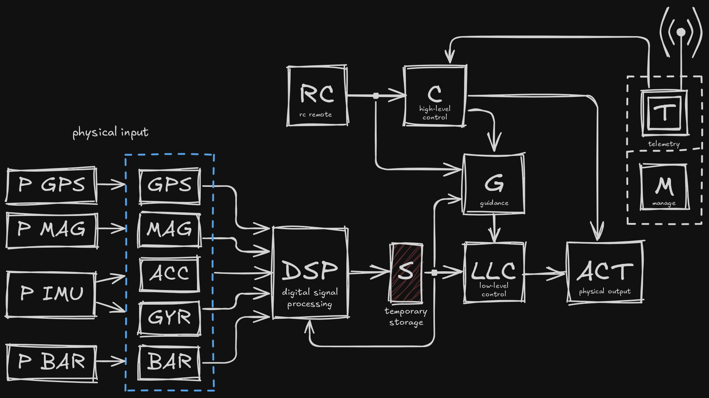

# FC firmware

## Software architecture

The code is modular and divided into modules.

### \[SYS\] System Core

Initializes the other modules and runs the main loop.

### \[C\] High Level Control

Switches between control modes.
Modes:
 - Idle
 - RC remote control
 - Soft landing (normal / abort)
 - Waypoint

### \[RC\] Remote Control

Uses SBUS to get .

### \[G\] Guidance

### \[T\] Telemetry

### \[LLC\] Low-level Control

### \[ACT\] Physical Output

### \[S\] Temporary Storage

### \[DSP\] Digital Signal Processing

### \[P GPS\] GPS IC

#### \[GPS\] GPS driver

### \[P MAG\] Magnetometer IC

#### \[MAG\] Magnetometer driver

### \[P IMU\] IMU IC / driver

#### \[ACC\] Accelerometer data source

#### \[GYR\] Gyroscope data source

### \[P BAR\] Barometer IC

#### \[BAR\] Barometer driver
